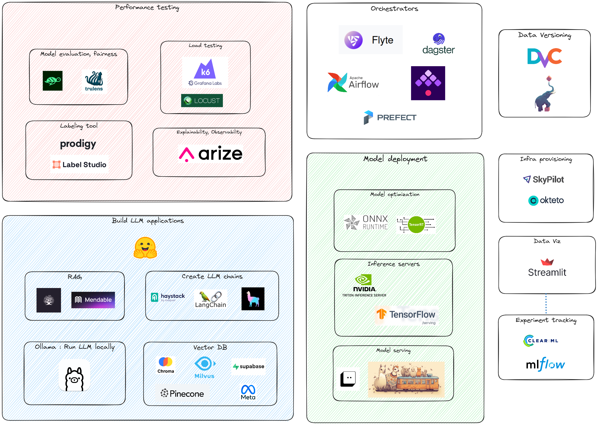

# Advent of Code for Open Source

Discovery of open source libraries, mostly related to LLMs. [AOC organized by Zilliz](https://zilliz.com/blog/advent-of-code-for-open-source).

Based on the libraries I discovered in December, I wrote a [blog post](https://medium.com/@michael.romagne/a-gentle-journey-to-llmops-zilliz-advent-of-code-293fe166926a) and created a tool map with the most interesting projects I know so far regarding LLMOps :

### Details of tools explored

- Day 1 : [Milvus](https://github.com/milvus-io/milvus)
- Day 2 : [FiftyOne](https://github.com/voxel51/fiftyone)
- Day 3 : [Quivr](https://github.com/StanGirard/quivr)
- Day 4 : [Haystack](https://haystack.deepset.ai/)
- Day 5 : [Proton](https://docs.timeplus.com/proton)
- Day 6 : [YData-synthetic](https://ydata.ai/)
- Day 7 : [Apache Flink](https://flink.apache.org/)
- Day 8 : [Langchain.rb](https://github.com/andreibondarev/langchainrb)
- Day 9 : [Flyte](https://github.com/flyteorg/flyte)
- Day 10 : [DVC 💚](https://github.com/iterative/dvc)
- Day 11 : [Phoenix - Arize AI](https://github.com/Arize-ai/phoenix)
- Day 12 : [Trulens](https://github.com/truera/trulens)
- Day 13 : [OpenLLM](https://github.com/bentoml/OpenLLM)
- Day 14: [Label Studio](https://github.com/HumanSignal/label-studio/)
- Day 15: [Llama Index](https://github.com/run-llama/llama_index)
- Day 16: [LLMWare](https://github.com/llmware-ai/llmware)
- Day 17: [Determined AI](https://github.com/determined-ai/determined)
- Day 18: [Apache Paimon](https://github.com/apache/incubator-paimon)
- Day 19: [Vectorflow](https://github.com/dgarnitz/vectorflow)
- Day 20 : [Pachyderm](https://github.com/pachyderm/pachyderm)
- Day 21: [GPTCache](https://github.com/zilliztech/gptcache)
- Day 22: [Ray](https://github.com/ray-project/ray)
- Day 23: [SuperGradients](https://github.com/Deci-AI/super-gradients)
- Day 24: [Temporian](https://github.com/google/temporian)

- Additional tools : [Giskard AI](https://github.com/Giskard-AI/giskard)
