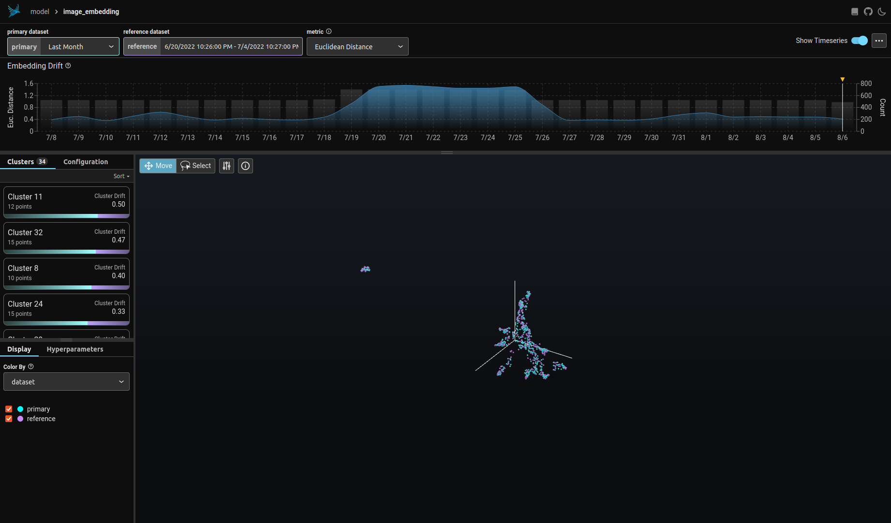
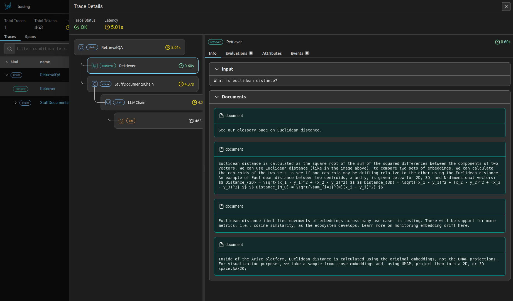
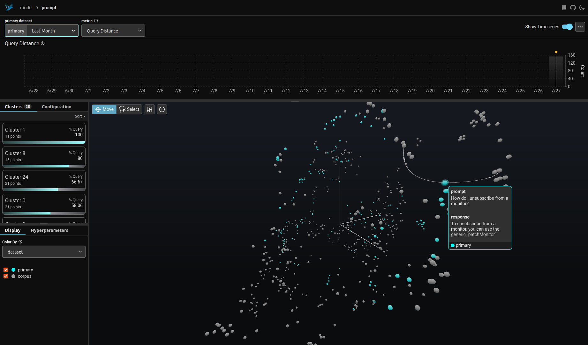

# Phoenix

Phoenix brings monitoring tools for your models and LLM Applications with very little configuration. You can do embedding analysis based on Umap, identify clusters and dig into them, to interpret drift or compare different model versions. 

[How UMAP works](https://umap-learn.readthedocs.io/en/latest/how_umap_works.html#how-umap-works)

It's also possible to debug your RAG with traces, which help you to understand the internals of your application (search and retrieval in vector stores, embedding generation, external tools...):

It's even possible to go further by visualizing your vector store. You just have to upload a corpus of your knowledge base along with your LLM application's inferences to help you troubleshoot hard to find bugs with retrieval. Bugs could be gaps in your documentation, queries that gave bad responses or failures to retrieve relevant context. It's a perfect tool for anyone using RAG.

**My opinion:** I used Umap and hdbscan in the past but it feels like Arize AI really brang these "raw" libraries to life with this product. It helps so much to understand what is going on with such complex models !
