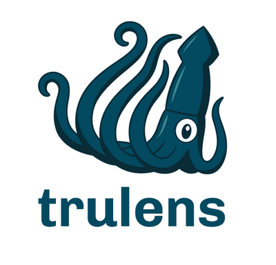

# Trulens 

TruLens provides tools for developing and monitoring neural nets, including large language models. This includes both tools for evaluation of LLMs and LLM-based applications with TruLens-Eval and deep learning explainability with TruLens-Explain. TruLens-Eval and TruLens-Explain are housed in separate packages and can be used independently.

I first tested the tutorials on trulens-eval, in which you build a RAG application using llama-index, chromaDB and gpt3.5. You then create metrics using trulens-eval and query the RAG application. Lastly, you can visualize metrics associated to your RAG application on a dashboard, with details of queries and "expected responses". This way, you are able to  understand and pick your best RAG application.

I also tried the trulens-explain package to explain the decisions of vgg16. I am not a big computer vision expert but this example with the Beagle image were not that impressive to me unfortunately. But I may just like expertise here.

**My opinion:** I was curious to test this library as I am a user of [Giskard AI](https://github.com/Giskard-AI/giskard) to test models, and Giskard also took the LLM wave. Trulens did the job pretty well with their tutorials. The streamlit app is nice and the metrics are interesting to evaluate LLMs. I am looking forward to catch up on Giskard AI progress to compare these two libraries.s
