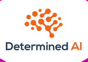

# Determined AI 

Determined AI is an open-source machine learning platform that streamlines distributed training, hyperparameter tuning, experiment tracking, and resource management. It integrates with PyTorch and TensorFlow and features a Python library for code compatibility, a Command Line Interface (CLI) for cluster management and model training, and a Web UI for visualizing various metrics like loss curves and hyperparameter plots.