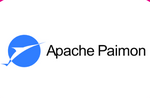

# Apache Paimon

Apache Paimon, formerly known as Flink Table Store, is an incubating streaming data lake platform. It specializes in high-speed data ingestion, change data tracking, and efficient real-time analytics, drawing architectural concepts from Apache Flink and Apache Iceberg.