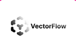

# Vectorflow

VectorFlow is an open-source vector embedding pipeline for high-volume data processing, supporting both textual and image data. It features a simple API for ingesting raw data, transforming it into vectors, and storing or returning them, with support for various file formats and a focus on fault tolerance, high throughput, and multi-modal data ingestion.