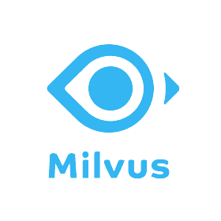

# Milvus

Milvus is an open-source vector database built to power embedding similarity search and AI applications. It's one of the oldest and more robust vector databases, it's resilient, battle-tested by thousands of companies relying on it, and its architecture is distributed and fine-tuned for high throughput. You have the choice between a hosted and on-premise solution.

I tested it using a tutorial from Trulens (Day12 of AOC).

**My opinion:** Milvus is one of the oldest vector databases and has good performances, it seems very reliable. It's also user friendly. However, it's still a bit hard for me to know which vector database is the best for a use case, especially since even [benchmarks are not clear](https://www.sicara.fr/blog-technique/how-to-choose-your-vector-database-in-2023). Zilliz also has its own [benchmark](https://zilliz.com/vector-database-benchmark-tool?database=ZillizCloud%2CMilvus%2CPgVector%2CElasticCloud%2CQdrantCloud%2CWeaviateCloud%2CPinecone&dataset=medium&filter=none%2Clow%2Chigh) on which they rank first. I look forward testing databases more on my use cases.
