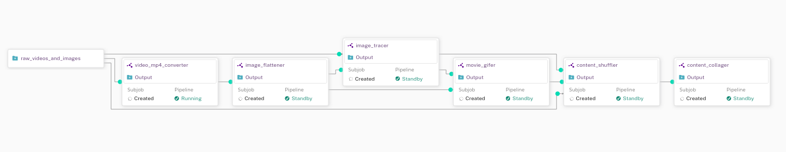

# [Pachyderm](https://github.com/pachyderm/pachyderm)

Pachyderm is a robust data engineering tool designed for automating complex pipelines and handling sophisticated data transformations across various data types. It's particularly cost-effective at scale and offers unique features. It operates within a Kubernetes cluster, which comes with more setup work but also with a lot of advantages like containerized pipelines, parallelized data processing and autoscaling.

It also supports **data triggering** (automatically trigger a pipeline if there is a change in data) and **scheduling**.

Last but not least, they propose a convenient CLI tool called PachCTL, but also a nice UI to visualize your DAGs, which is a strong plus.

**My opinion:** As I said on Day10 of this Advent of code, I have been using DVC for quite some time now, so I was eager to discover Pachyderm and what is different between these two tools.

I must say that Pachyderm is a more complex solution than DVC. Huge advantages of Pachyderm compared to DVC are autoscaling, data parallelization and orchestration without a doubt. The UI is also a big plus.

But complexity also means setup issues. I had problems installing it on minikube, and I saw several reddit posts stating that it's pretty complicated to maintain, but worth it given the additional features it provides.

So in the end, I think as a data science team grows in size and workload complexity increases, Pachyderm is the way to go.
DVC, on the other hand, is much lighter and very dedicated to versioning data but not much more. DVC is more streamlined and suitable for simpler or medium-scale projects, even extending into some production scenarios. The choice between them should be based on the specific requirements and scale of the data project : **do you need autoscaling, scheduling, parallelized processing ?**

