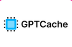

# GPTCache

GPTCache is a semantic cache system for Large Language Models (LLMs) like ChatGPT, designed to store LLM responses and reduce API call expenses and response times. It employs semantic caching to identify and store similar or related queries, using embedding algorithms and vector storage for similarity searches. This modular system enhances caching efficiency and performance, offering benefits like cost reduction, improved query throughput, and an adaptable environment for development and testing. GPTCache's modular design allows for customization and optimization, using metrics like hit ratio, latency, and recall to gauge cache performance.