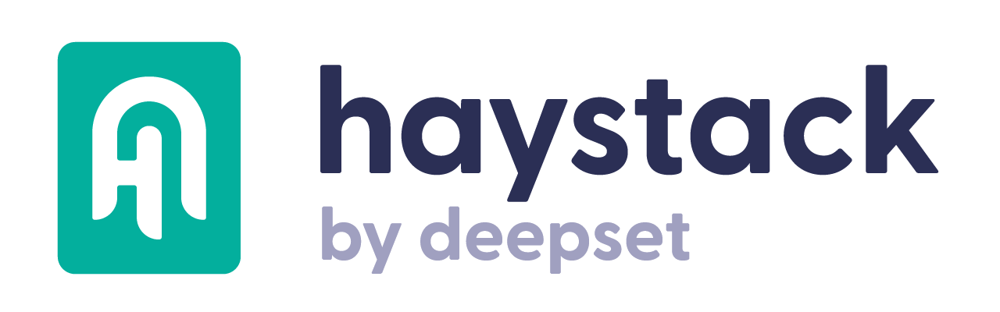

# Haystack, by Deepset

Haystack is a LLM orchestration framework to quickly build custom LLM applications. You can connect components (models, vector DBs, file converters) to pipelines or agents that can interact with your data, that are stored in DocumentStores. Haystack proposes already 31 integrations as of December 2023 with for instane HuggingFace, Notion extractor, Milvus, FAISS, Chroma DB...

Examples of use cases that you can tackle with Haystack:

- build RAG, with any vector database available and customizing your LLM interaction  
- Question answering based on a set of FAQ documents, to provide answers to new incoming questions  
- Semantic search and retrieve most relevant documents according to meaning  
- Create more complex pipelines...  
- Fine tune LLMs  
- Get user feedback  

**My Opinion:** I loved their tutorials, they are pretty straightforward and it's very easy to build LLM applications. I tested the Text to image search with OpenAI CLIP model and it was clean.

The biggest thing I wanted to figure out is **how does it differ from LangChain ?**

In the end, LangChain is more complete, already has 500+ integrations and is more flexible than Haystack. However, Haystack is much more intuitive and it's much quicker to set pipelines with a low complexity. So I think for production use cases that require flexibility I would stick with Langchain. But for proof of concepts Haystack is definitely worth a try, and maybe it has even more potential than only PoCs.