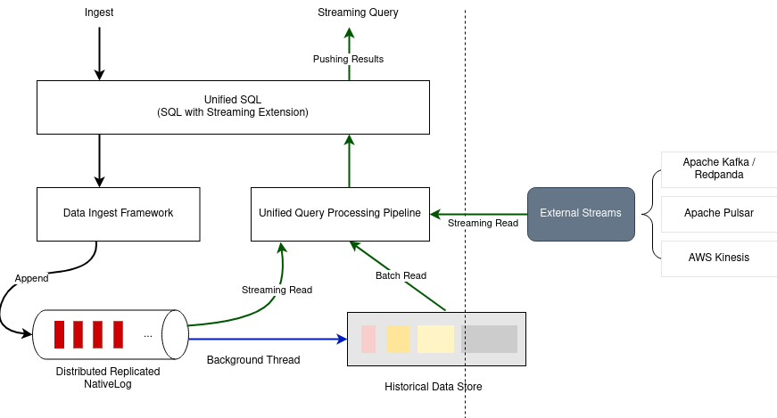
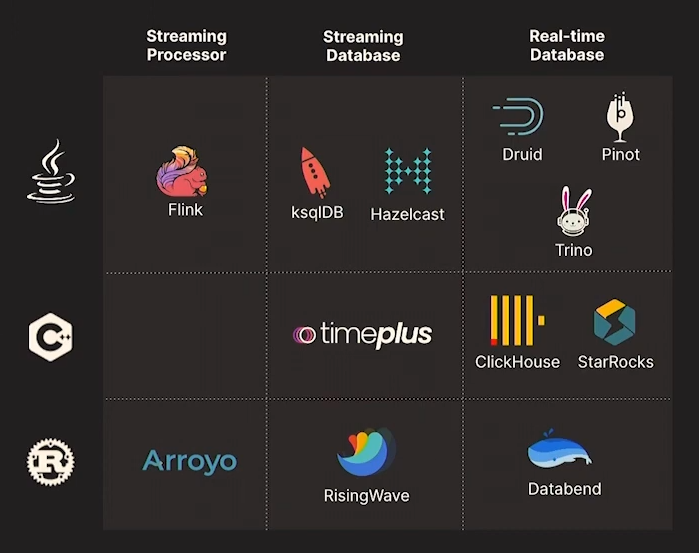

# Proton

Timeplus is a streaming-first data analytics platform. It provides powerful end-to-end capabilities, leveraging the open source streaming database Proton, to help teams process streaming and historical data quickly and intuitively, accessible for organizations of all sizes and industries. It enables data engineers and platform engineers to unlock streaming data value **using SQL**.

The Timeplus console allows for easy connection to diverse data sources (such as Apache Kafka, Confluent Cloud, Redpanda, CSV file upload, and more), explore streaming patterns via SQL queries, send real-time insights and alerts to other systems or individuals, and create dashboards and visualizations.

Here is an architecture diagram describing Proton :

Streams are similar to tables in traditional SQL databases. It makes Proton quick to adopt.

Low level kafka management can be hard and proton eases all that stuff to query data on Kafka streams. It's challenging and boring otherwise.

Other solutions like Flink exist, but the major difference with Proton is the historical aspect. Flink will dump data in S3 for instance but you will not be able to query history using Flink, whereas this is possible with Proton.

*Source: https://www.youtube.com/watch?v=Gw_qUTdcdEg*

**My Opinion:** Interesting to see a new streaming database. I see the added value here, Proton seems interesting however it's not my expertise and is a bit far from my concern for now so I did not push the test very far. I would still recommend the talk mentionned above for anyone working on the subject, and will refer to it in the future when needed.

