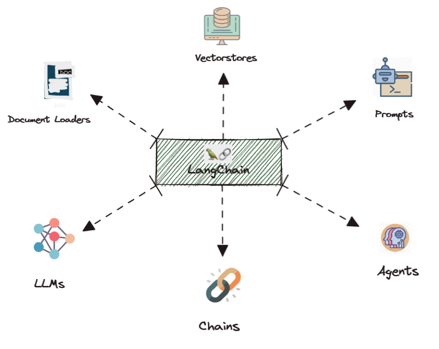

# Langchain RB

[git repo Langchain.rb](https://github.com/andreibondarev/langchainrb)

Langchain.rb brings Langchain framework into the Ruby world, making it a breeze for developers to work with Large Language Models like GPT-4 or LLAMA 2. Langchain is designed to cut down on the heavy lifting when integrating AI into your projects. It handles a lot of the common tasks with AI models, like managing conversation memory and connecting various AI tasks seamlessly. Plus, it offers a range of ready-to-use prompts, which is a huge time-saver. In a few minutes, you are able to build powerful RAG pipelines or conversational bots, which is awesome.

You are even able to combine multiple LLM in a full complex chain to refine LLM responses, or leverage more context with the [Map reduce chain](https://python.langchain.com/docs/modules/chains/document/map_reduce) for instance...

 

**My Opinion:** Langchain is great, and this implementation in Ruby must be a game changer for a lot of people. A few days ago, I tested Haystack, that was even easier than Langchain. But I appreciate the tradeoff between abstraction and flexibility Langchain proposes, and I will continue using it in the future. Have fun with this library, Ruby folks !
