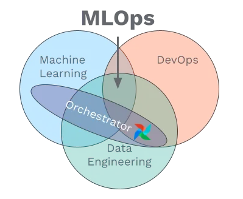

# Flyte

Flyte is an open-source orchestrator that facilitates building production-grade data and ML pipelines. It is built for scalability and reproducibility, leveraging Kubernetes as its underlying platform. With Flyte, user teams can construct pipelines using the Python SDK, and seamlessly deploy them on both cloud and on-premises environments, enabling distributed processing and efficient resource utilization.

"The orchestrator is an essential component in any MLOps stack as it is responsible for running your machine learning pipelines. To do so, the orchestrator provides an environment which is set up to execute the steps of your pipeline. It also makes sure that the steps of your pipeline only get executed once all their inputs (which are outputs of previous steps of your pipeline) are available." Quote from an article demonstrating the importance of MLOx : [ML Orchestrator](https://towardsdatascience.com/machine-learning-orchestration-vs-mlops-d4cfe3b7bec)

A good ML orchestrator should provid DAGs (Directed Acyclic Graphs) describing workflows, scheduling to run workflows on time and monitoring of these workflows executions.

**My opinion :** This is very timely, as we are building our MLOps stack at GitGuardian from scratch, orchestrators will be our next priority after model serving. I see that there are a lot of possibilities : Argo workflows, kestra, Prefect, Dagster... How about Flyte ?

The first steps are clear and the tool is intuitive with its nice decorators that really look alike other orchestrators like Prefect. It does the job.

However, an important factor for me is the compatibility with DVC pipelines to track data. DVC should track data inputs and outputs, whereas the orchestrator will mostly schedule runs and containerize steps. Each DVC stage could be a task for instance, and we could run the whole flow on a regular schedule. If we had a lot of steps inside a DVC stage, we could even cut it into more tasks and do one workflow per dvc stage, that will in the end be subworkflows in the overall workflow.

I took advantage of this test to try to combine Flyte and DVC, but it did not go well, mostly because of strong type system used by Flyte. I will dig more into this in the future. And probably give a chance to Airflow which seems the way to go.
